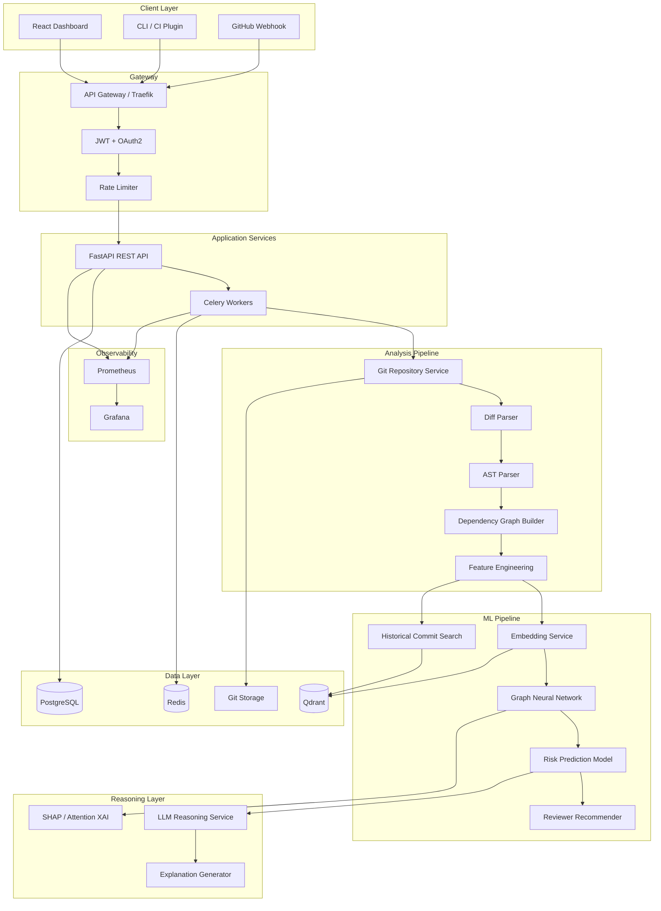
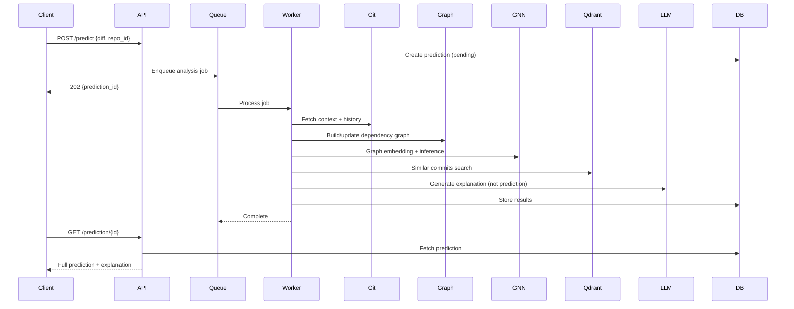
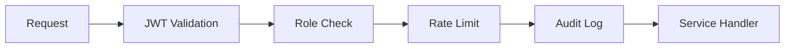

# Code Impact Predictor AI — System Architecture

## Executive Summary

Code Impact Predictor AI is a production-grade ML system that predicts the downstream impact of source code changes. It combines **Graph Neural Networks** for structural prediction, **vector search** for historical similarity, and **LLMs** exclusively for reasoning and explanation — never for numeric prediction.

## Design Principles

| Principle | Implementation |
|-----------|----------------|
| Clean Architecture | Domain → Application → Infrastructure → Presentation |
| SOLID | Interface segregation for repos, single-responsibility services |
| DDD | Bounded contexts: Analysis, Prediction, Graph, Repository, Identity |
| CQRS | Separate read/write models for predictions and graph queries |
| ML/LLM Separation | GNN + classical ML predict; LLM explains only |

## High-Level Architecture



## Bounded Contexts

```mermaid
graph LR
    subgraph Identity Context
        U[Users]
        R[Roles]
        T[Tokens]
    end

    subgraph Repository Context
        REPO[Repositories]
        COMM[Commits]
        PR[Pull Requests]
        SYNC[Sync Jobs]
    end

    subgraph Analysis Context
        DIFF2[Diffs]
        AST2[AST Trees]
        COMP[Complexity Metrics]
    end

    subgraph Graph Context
        N[Nodes]
        E[Edges]
        G[Graph Snapshots]
    end

    subgraph Prediction Context
        PRED[Predictions]
        RISK2[Risk Scores]
        AFF[Affected Files]
        CONF[Confidence]
    end

    subgraph Knowledge Context
        EMB2[Embeddings]
        ISS[Issues]
        BUG[Bug Reports]
        SIM[Similar Items]
    end

    Repository Context --> Analysis Context
    Analysis Context --> Graph Context
    Graph Context --> Prediction Context
    Knowledge Context --> Prediction Context
```

## Why GNN Over Pure LLM for Prediction

| Aspect | GNN | Pure LLM |
|--------|-----|----------|
| Structural awareness | Native graph message passing over call/import edges | Text-only; misses multi-hop dependencies |
| Determinism | Reproducible inference | Non-deterministic, temperature-sensitive |
| Latency | Milliseconds on GPU | Seconds per request |
| Cost | Fixed infra cost | Per-token API cost at scale |
| Explainability | Node/edge attention, SHAP on features | Opaque chain-of-thought |
| Training signal | Supervised on historical regressions | No direct regression labels |
| Cold start | Repository graph provides signal | Needs long context windows |

**LLM role**: Post-prediction reasoning, root cause narrative, reviewer justification, risk explanation in natural language.

## Data Flow: Online Inference



## Technology Stack Mapping

| Component | Technology | Purpose |
|-----------|------------|---------|
| API | FastAPI | Async REST, OpenAPI |
| Workers | Celery + Redis | Async pipeline |
| ML | PyTorch + PyG | GNN training/inference |
| Embeddings | Sentence Transformers | Code/text vectors |
| Vector DB | Qdrant | Similarity search |
| RDBMS | PostgreSQL | Metadata, predictions |
| Git | GitPython + libgit2 | Repo cloning, diffs |
| Auth | JWT + OAuth2 | RBAC |
| Monitoring | Prometheus + Grafana | SLO tracking |
| Deploy | Docker Compose → K8s | Progressive scale |

## Security Architecture



- **Secrets**: Environment variables + Docker secrets; never in code
- **RBAC**: `admin`, `analyst`, `viewer`, `service_account`
- **Rate limiting**: Redis sliding window per user/API key
- **Git credentials**: Encrypted at rest in PostgreSQL

## Scalability Path

1. **Phase 1**: Monolith API + Celery workers (Docker Compose)
2. **Phase 2**: Separate embedding service, GNN inference service
3. **Phase 3**: Kubernetes with HPA on workers and inference pods
4. **Phase 4**: Multi-tenant sharding by repository org

## Step Roadmap

| Step | Focus |
|------|-------|
| **1** | Foundation: Architecture, Domain, Infrastructure |
| **2** | Git Service, Diff Parser, AST Analyzer |
| **3** | Dependency Graph Builder |
| **4** | Vector Embedding Service + Qdrant |
| **5** | GNN Model + Training Pipeline |
| **6** | Risk Prediction + Reviewer Recommender |
| **7** | LLM Reasoning + Explanation Layer |
| **8** | REST API (full endpoints) |
| **9** | React Frontend + Visualizations |
| **10** | XAI (SHAP, Attention) |
| **11** | Evaluation Framework |
| **12** | CI/CD, Monitoring, Production Hardening |
