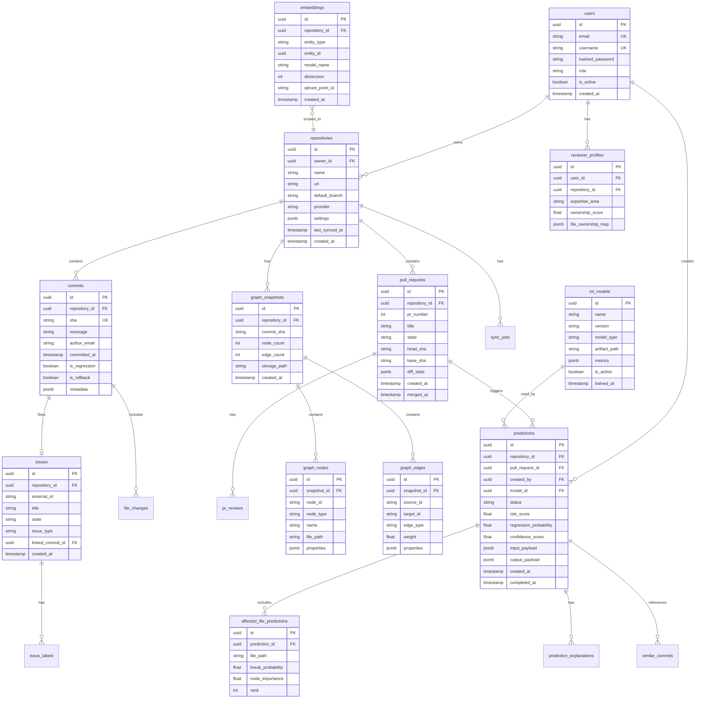

# Database Design

## Entity Relationship Diagram

## Indexing Strategy

- `commits(repository_id, sha)` — unique composite
- `predictions(repository_id, created_at DESC)` — history queries
- `graph_nodes(snapshot_id, node_type, file_path)` — graph lookups
- `embeddings(entity_type, entity_id)` — deduplication
- Partial index on `predictions(status)` WHERE status = 'pending'

## CQRS Read Models

| Read Model | Source Tables | Purpose |
|------------|---------------|---------|
| `prediction_summary_view` | predictions + affected_files | Dashboard list |
| `repository_risk_view` | predictions aggregated | Heatmap |
| `reviewer_expertise_view` | reviewer_profiles + graph_nodes | Reviewer ranking |
