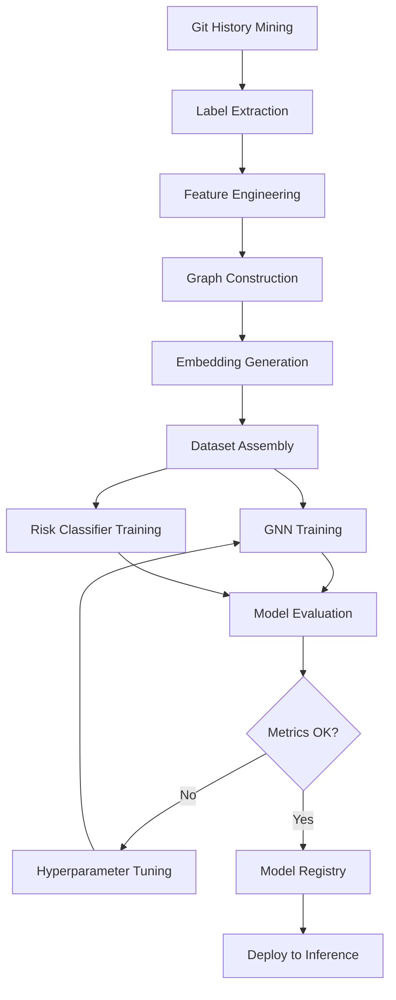
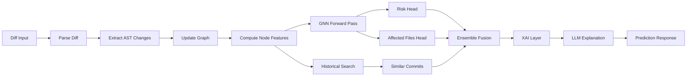
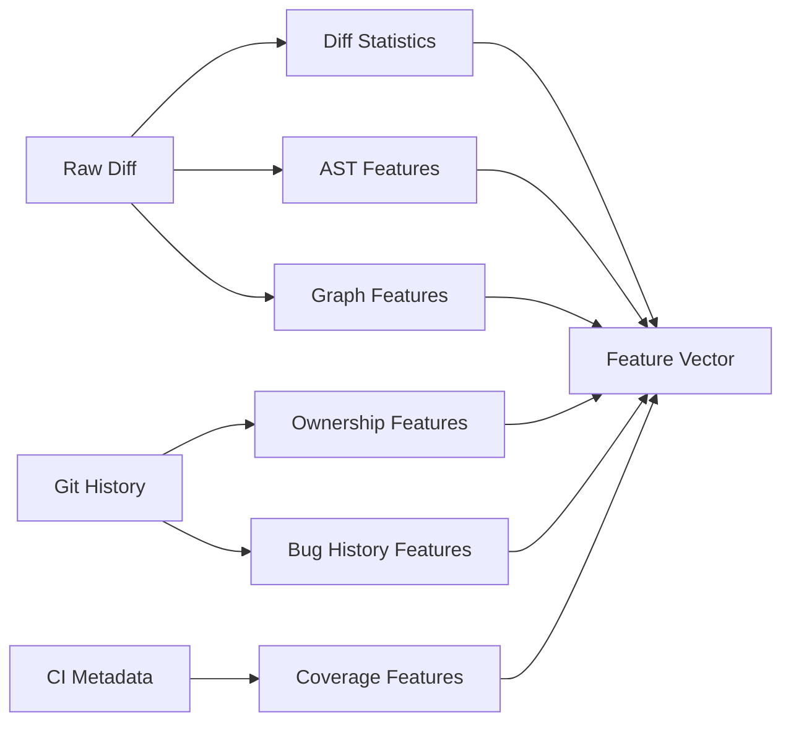

# AI Pipeline Design

## Offline Training Pipeline



## Online Inference Pipeline



## Training Dataset Construction

Each training sample is derived from Git history:

```python
@dataclass
class TrainingSample:
    diff: str                          # Unified diff
    changed_files: list[str]           # Files in diff
    previous_commit_sha: str           # Parent commit
    next_commit_sha: str               # Commit under study
    bug_labels: list[str]              # From issue tracker
    is_rollback: bool                  # Revert commit detection
    is_regression: bool                # Post-commit bug linked
    files_changed_after_regression: list[str]  # Fix commit files
    issue_ids: list[str]
    pr_id: str | None
    review_comments: list[str]
    graph_snapshot: GraphSnapshot      # At previous_commit
    node_features: Tensor              # Per-node features
    edge_index: Tensor                 # PyG format
    labels: TrainingLabels
```

### Label Extraction Heuristics

1. **Regression label**: Commit C followed within N days by fix commit F where issue links C
2. **Rollback label**: Commit message contains `revert` or git identifies revert relationship
3. **Affected files label**: Files modified in fix commit F that weren't in C but depend on C's changes
4. **Bug labels**: Extracted from linked Jira/GitHub issue types

### Negative Sampling

- Random commits with no subsequent bugs (ratio 3:1)
- Hard negatives: large diffs with no regression
- Temporal split: train on t < T, validate on T ≤ t < T+Δ, test on t ≥ T+Δ

## Model Architecture

### GNN: CodeImpactGNN

```
Input: H (node features), edge_index, batch
  ↓
GraphSAGE Layer 1 (hidden=256) + BatchNorm + ReLU + Dropout
  ↓
GraphSAGE Layer 2 (hidden=256) + BatchNorm + ReLU + Dropout
  ↓
GraphSAGE Layer 3 (hidden=128) + BatchNorm + ReLU
  ↓
Global Mean Pool → graph embedding
  ↓
┌─────────────────┬──────────────────┐
│ Risk Head (MLP) │ File Head (MLP)  │
│ → risk_score    │ → per-node logits│
│ → reg_prob      │ → affected files │
└─────────────────┴──────────────────┘
```

### Input Features (per node)

| Feature | Source |
|---------|--------|
| Embedding dim 384 | Sentence Transformer on file content |
| Cyclomatic complexity | AST analysis |
| Change magnitude | Diff stats (added/deleted lines) |
| Historical bug count | Issue tracker |
| Test coverage delta | CI metadata |
| Ownership entropy | Git blame |
| PageRank score | Dependency graph |
| Is directly changed | Diff parser (binary) |

### Output Heads

| Output | Type | Loss |
|--------|------|------|
| risk_score | Regression [0,100] | MSE + calibration |
| regression_probability | Binary | BCE |
| affected_files | Multi-label | BCE per node |
| confidence | Regression [0,1] | Derived from ensemble variance |

## Feature Engineering



## Evaluation Metrics

| Metric | Target | Use Case |
|--------|--------|----------|
| Precision@K | ≥ 0.70 | Affected files top-K |
| Recall@K | ≥ 0.65 | Affected files top-K |
| F1 | ≥ 0.67 | Binary regression |
| ROC AUC | ≥ 0.85 | Risk classification |
| MRR | ≥ 0.60 | Similar commit ranking |
| MAP | ≥ 0.55 | Reviewer recommendation |
| Calibration ECE | ≤ 0.05 | Confidence reliability |

## Optimization Ideas

- **Graph sampling**: Neighbor sampling for large repos (GraphSAINT)
- **Incremental graphs**: Delta updates instead of full rebuild
- **Model distillation**: Smaller GNN for low-latency path
- **Caching**: Redis cache for graph embeddings per commit SHA
- **Batch inference**: Queue batching for PR webhooks

## Future Improvements

- Cross-repository transfer learning
- Temporal GNN for commit sequence modeling
- Contrastive learning on bug/non-bug commit pairs
- Active learning from reviewer feedback
- Federated learning across org repos
