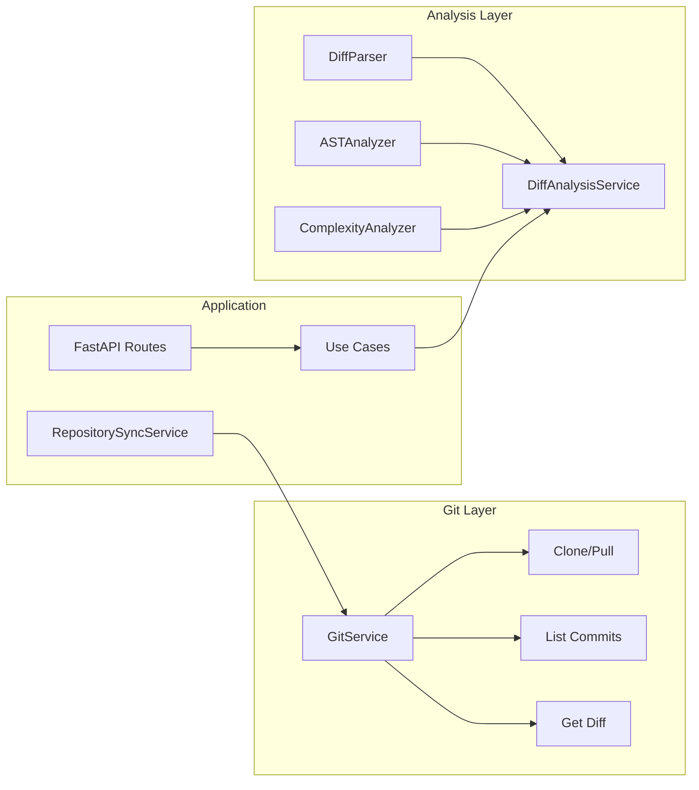
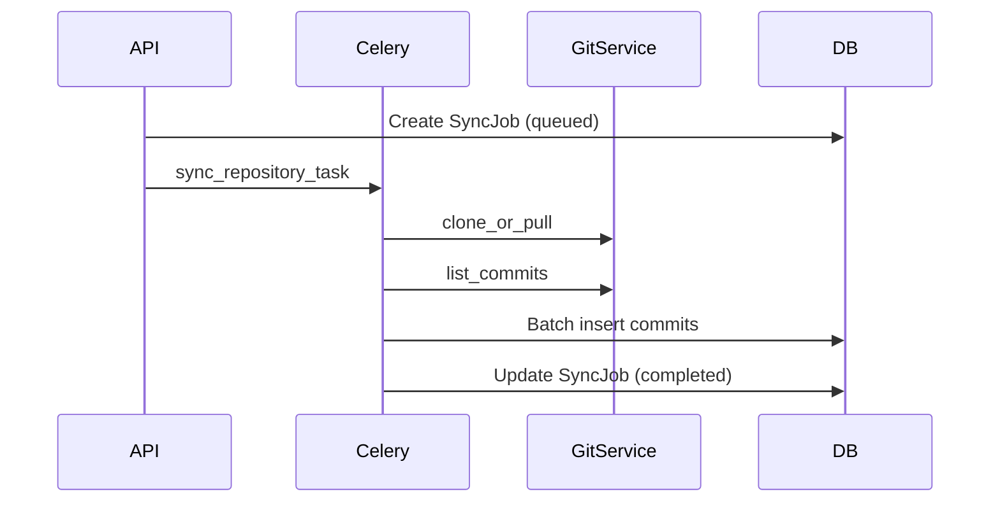

# Step 2: Git Service, Diff Parser & AST Analyzer

## Overview

Step 2 implements the **analysis foundation** — the components that transform raw Git data into structured features for downstream ML.

## Architecture

## Components

| Component | Path | Responsibility |
|-----------|------|----------------|
| GitService | `infrastructure/git/git_service.py` | Clone, pull, list commits, diffs |
| DiffParser | `infrastructure/analysis/diff_parser.py` | Parse unified diffs via unidiff |
| ASTAnalyzer | `infrastructure/analysis/ast_analyzer.py` | Tree-sitter + regex fallback |
| ComplexityAnalyzer | `infrastructure/analysis/complexity_analyzer.py` | Radon (Python) + branch proxy |
| DiffAnalysisService | `infrastructure/analysis/diff_analysis_service.py` | Orchestrates enrichment |
| RepositorySyncService | `application/services/repository_sync_service.py` | Sync orchestration |

## API Endpoints (New/Updated)

| Method | Endpoint | Description |
|--------|----------|-------------|
| POST | `/api/v1/repository` | Register repo (persisted to PostgreSQL) |
| GET | `/api/v1/repository/{id}` | Get repository details |
| POST | `/api/v1/repository/{id}/sync` | Queue clone/pull + commit indexing |
| POST | `/api/v1/analyze/diff` | Parse diff + AST + complexity |

## Sync Pipeline

## Testing Strategy

| Test Type | Coverage |
|-----------|----------|
| Unit | DiffParser, ASTAnalyzer, GitService, DiffAnalysisService |
| Integration | API with in-memory repositories |
| Manual | `POST /analyze/diff` with real diff payloads |

Run: `PYTHONPATH=src pytest tests/ -v`

## Best Practices

- Git I/O runs in `asyncio.to_thread` — non-blocking for FastAPI
- Tree-sitter with regex fallback — graceful degradation
- ML/LLM separation preserved — analysis produces features, not predictions
- Repository pattern — all DB access through interfaces

## Optimization Ideas

- Shallow clone with incremental deepen
- Commit indexing in batches of 500
- Cache AST results per file SHA

## Future (Step 3)

- Dependency graph builder consumes AST imports + Git structure
- Graph snapshots stored per commit SHA
