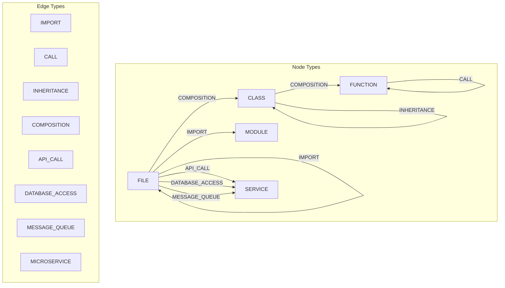
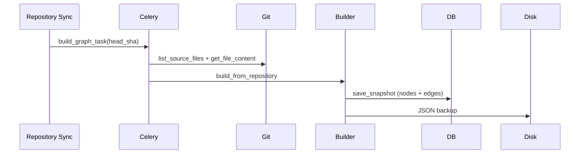

# Step 3: Dependency Graph Builder

## Overview

Step 3 builds **multi-layer dependency graphs** from repository source code at a specific commit. These graphs are the primary structural input for the GNN (Step 5).

## Graph Model



## Components

| Component | Path | Role |
|-----------|------|------|
| StructureAnalyzer | `infrastructure/analysis/structure_analyzer.py` | Calls, inheritance, external deps |
| DependencyGraphBuilder | `infrastructure/graph/dependency_graph_builder.py` | Full graph construction |
| GraphStorage | `infrastructure/graph/graph_storage.py` | JSON snapshot persistence |
| SubgraphExtractor | `infrastructure/graph/subgraph_extractor.py` | BFS for affected-file views |
| GraphBuildService | `application/services/graph_build_service.py` | Orchestration + DB persist |
| SqlAlchemyGraphRepository | `infrastructure/persistence/repositories.py` | PostgreSQL storage |

## API Endpoints

| Method | Endpoint | Description |
|--------|----------|-------------|
| GET | `/api/v1/graph/{repository_id}` | Latest graph snapshot |
| GET | `/api/v1/graph/{repository_id}/{commit_sha}` | Graph at commit |
| GET | `/api/v1/graph/{repository_id}/subgraph?files=a.py&files=b.py` | BFS subgraph |
| POST | `/api/v1/graph/{repository_id}/build?commit_sha=...` | Build synchronously |
| POST | `/api/v1/graph/{repository_id}/build?commit_sha=...&async_build=true` | Queue Celery job |

## Pipeline



After every successful repository sync, a graph build is automatically queued for `head_sha`.

## Node ID Convention

```
file:path/to/file.py
class:path/to/file.py:ClassName
function:path/to/file.py:qualified.name
module:app.service
service:api:httpx
```

## Testing

Run: `PYTHONPATH=src:tests pytest tests/unit/graph/ -v`

## Next Step

Step 4: Vector Embedding Service + Qdrant — embed commits, files, and graph nodes for similarity search.
