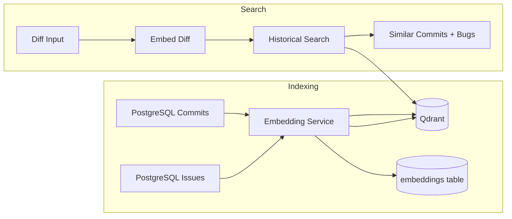

# Step 4: Vector Embedding Service + Qdrant

## Overview

Step 4 adds **semantic search** over commits, issues, and diffs using Sentence Transformers and Qdrant. This powers similar commit/bug retrieval for the GNN prediction pipeline — not LLM prediction.

## Architecture



## Components

| Component | Path | Role |
|-----------|------|------|
| SentenceTransformerEmbeddingService | `infrastructure/embeddings/` | Production embeddings |
| MockEmbeddingService | `infrastructure/embeddings/` | Deterministic test embeddings |
| QdrantVectorStore | `infrastructure/vector/qdrant_store.py` | Qdrant adapter |
| InMemoryVectorStore | `infrastructure/vector/` | Test vector store |
| EmbeddingIndexService | `application/services/` | Batch indexing orchestration |
| HistoricalSearchService | `infrastructure/search/` | IHistoricalSearch implementation |

## Qdrant Collections

| Collection | Payload Fields |
|------------|----------------|
| `commits` | repository_id, commit_sha, message, is_regression, linked_issue_ids |
| `issues` | repository_id, external_id, title, issue_type, state |
| `docs` | Reserved for architecture/design docs (Step 7+) |

## API Endpoints

| Method | Endpoint | Description |
|--------|----------|-------------|
| POST | `/api/v1/embeddings/index/{repository_id}` | Index commits + issues |
| POST | `/api/v1/embeddings/index/{repository_id}?async_index=true` | Queue Celery job |
| POST | `/api/v1/search/similar` | Search by diff text |
| GET | `/api/v1/search/similar/{repository_id}?diff=...` | Quick search |

## Automation Pipeline

```
Repository Sync → Graph Build → Embedding Index
```

Each stage queues automatically after the previous completes.

## Configuration

```env
EMBEDDING_MODEL=sentence-transformers/all-MiniLM-L6-v2
EMBEDDING_BACKEND=sentence_transformer  # or mock for tests
QDRANT_HOST=qdrant
QDRANT_PORT=6333
```

## Testing

Uses `MockEmbeddingService` + `InMemoryVectorStore` — no Qdrant or GPU required.

Run: `PYTHONPATH=src:tests pytest tests/unit/embeddings/ tests/unit/vector/ -v`

## Next Step

Step 5: GNN Model + Training Pipeline
