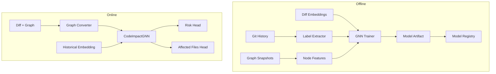

# Step 5: GNN Model + Training Pipeline

## Overview

Step 5 adds the **Graph Neural Network prediction core** — a GraphSAGE-based `CodeImpactGNN` with offline training, model registry, and inference services. This is real ML prediction, not LLM reasoning.

## Architecture



## Components

| Component | Path | Role |
|-----------|------|------|
| CodeImpactGNN | `ml/models/code_impact_gnn.py` | GraphSAGE encoder + risk/file heads |
| NodeFeatureBuilder | `ml/features/node_feature_builder.py` | 32-dim structural node features |
| graph_to_tensors | `ml/features/graph_converter.py` | GraphSnapshot → PyG tensors |
| LabelExtractor | `ml/training/label_extractor.py` | Regression/rollback heuristics |
| TrainingDatasetBuilder | `ml/training/sample_builder.py` | Mine labeled samples from DB + Git |
| GNNTrainer | `ml/training/trainer.py` | Training loop + checkpoint export |
| GNNPredictor | `ml/inference/gnn_predictor.py` | Production inference (`IGNNPredictor`) |
| MockGNNPredictor | `ml/inference/mock_gnn_predictor.py` | Heuristic fallback for tests/dev |
| FileModelRegistry | `ml/model_registry.py` | Artifact + JSON registry index |

## Model Architecture

```
Input: node features (32), edge_index, optional historical embedding (384)
  ↓
GraphSAGE × 3 (256 → 256 → 128) + BatchNorm + ReLU + Dropout
  ↓
Global Mean Pool + concat(historical)
  ↓
Risk Head → risk_score [0–100], regression logit
Node Head → per-node affected-file logits
Confidence Head → [0–1]
```

## Configuration

| Setting | Default | Description |
|---------|---------|-------------|
| `GNN_BACKEND` | `mock` | `mock` or `pytorch` |
| `GNN_MODEL_PATH` | `/app/models/gnn/latest.pt` | Checkpoint path |
| `MODEL_STORAGE_PATH` | `/data/models` | Registry + artifacts |
| `INFERENCE_DEVICE` | `cpu` | PyTorch device |

## Training CLI

```bash
python scripts/train_gnn.py --repository-id <uuid> --epochs 10 --output models/gnn/latest.pt
```

Requires synced commits and graph snapshots for the repository.

## Dependency Injection

`get_gnn_predictor()` returns:
- `MockGNNPredictor` when `gnn_backend=mock`
- `GNNPredictor` when checkpoint exists
- Falls back to mock if checkpoint missing

## Tests

```bash
pytest tests/unit/ml/ -v
```

Uses `pytest.importorskip("torch")` for PyTorch-dependent tests; structural tests run without GPU.

## Next Step

**Step 6 — Risk Prediction + Reviewer Recommender**: ensemble fusion, classical risk classifier, reviewer scoring, and wiring into `/predict`.
