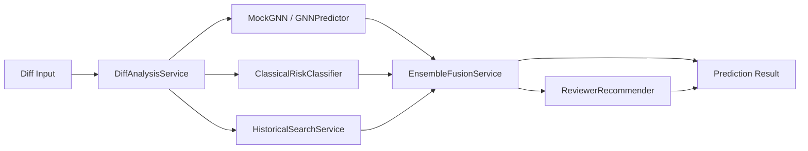
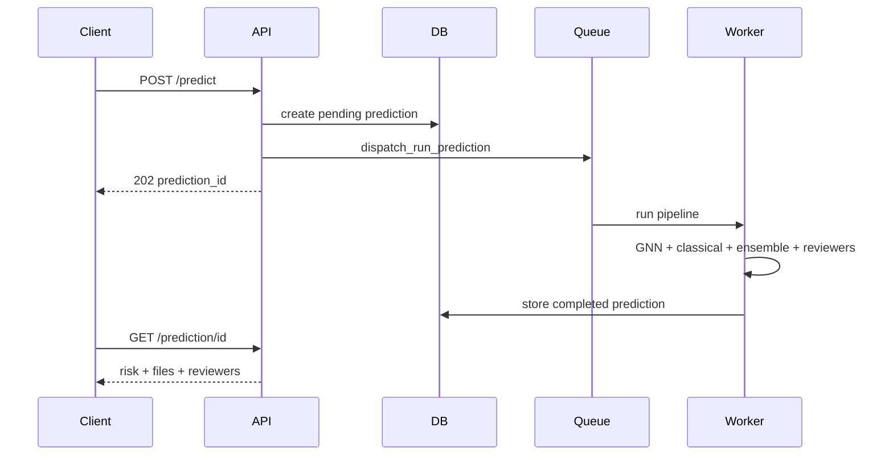

# Step 6: Risk Prediction + Reviewer Recommender

## Overview

Step 6 wires the **full ML prediction pipeline** — GNN + classical risk classifier + historical signals fused via ensemble, plus reviewer recommendation — into `POST /predict` and `GET /prediction/{id}`.

LLM narrative explanation remains a stub until Step 7.

## Architecture

## Components

| Component | Path | Role |
|-----------|------|------|
| ClassicalRiskClassifier | `ml/risk/classical_risk_classifier.py` | Weighted heuristic on diff + history features |
| EnsembleFusionService | `ml/risk/ensemble_fusion.py` | Fuse GNN + classical + historical; variance confidence |
| ReviewerRecommender | `infrastructure/recommendation/` | Ownership + expertise ranking |
| PredictionPipelineService | `application/services/prediction_pipeline_service.py` | End-to-end orchestration |
| SqlAlchemyPredictionRepository | `infrastructure/persistence/repositories.py` | Persist predictions + affected files |
| run_prediction_pipeline_task | `infrastructure/queue/tasks/prediction.py` | Celery async execution |

## Ensemble Weights (configurable)

| Setting | Default |
|---------|---------|
| `ENSEMBLE_GNN_WEIGHT` | 0.5 |
| `ENSEMBLE_CLASSICAL_WEIGHT` | 0.3 |
| `ENSEMBLE_HISTORICAL_WEIGHT` | 0.2 |

## API Flow

## Endpoints

| Method | Endpoint | Status |
|--------|----------|--------|
| POST | `/api/v1/predict` | ✅ queues pipeline |
| GET | `/api/v1/prediction/{id}` | ✅ returns result |
| GET | `/api/v1/history/{repo_id}` | ✅ list predictions |
| GET | `/api/v1/risk/{repo_id}` | ✅ risk summary |

## Next Step

**Step 7 — LLM Reasoning + Explanation Layer**: replace stub explanations with OpenAI/Claude narrative.
