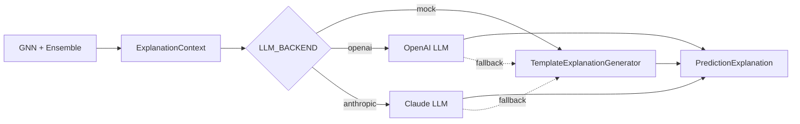

# Step 7: LLM Reasoning + Explanation Layer

## Overview

Step 7 adds the **LLM explanation layer** — natural language narratives for pre-computed ML predictions. The LLM never changes risk scores, probabilities, or file rankings.

## Architecture

## Components

| Component | Path | Role |
|-----------|------|------|
| ExplanationContext | `domain/services/__init__.py` | All ML outputs for explanation |
| prompt_builder | `infrastructure/llm/prompt_builder.py` | Structured JSON prompt |
| TemplateExplanationGenerator | `infrastructure/llm/template_explanation_generator.py` | Deterministic mock/dev narratives |
| LLMExplanationGenerator | `infrastructure/llm/llm_explanation_generator.py` | OpenAI/Anthropic with template fallback |
| build_explanation_generator | `infrastructure/llm/factory.py` | Settings-based factory |

## ML / LLM Separation

The system prompt explicitly instructs the LLM:

- **Must NOT** predict or modify numeric scores
- **Must ONLY** explain why the ML ensemble produced its outputs
- Receives frozen `risk_score`, `regression_probability`, `affected_files` in the prompt

## Configuration

| Setting | Default | Description |
|---------|---------|-------------|
| `LLM_BACKEND` | `mock` | `mock`, `openai`, or `anthropic` |
| `LLM_MODEL` | `gpt-4o-mini` | Model name for provider |
| `OPENAI_API_KEY` | — | Required when `LLM_BACKEND=openai` |
| `ANTHROPIC_API_KEY` | — | Required when `LLM_BACKEND=anthropic` |

Without API keys, the factory falls back to `TemplateExplanationGenerator`.

## Explanation Fields

| Field | Content |
|-------|---------|
| `root_cause` | Why the change may have downstream impact |
| `risk_explanation` | Narrative for ensemble risk score |
| `affected_files_explanation` | Why listed files may break |
| `reviewer_explanation` | Reviewer ownership/expertise rationale |

## Next Step

**Step 8 — Full REST API**: auth, webhooks, remaining endpoints, production hardening.
