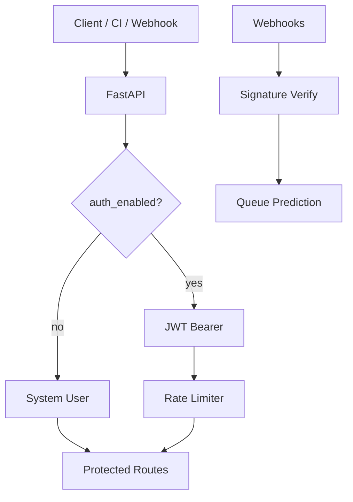
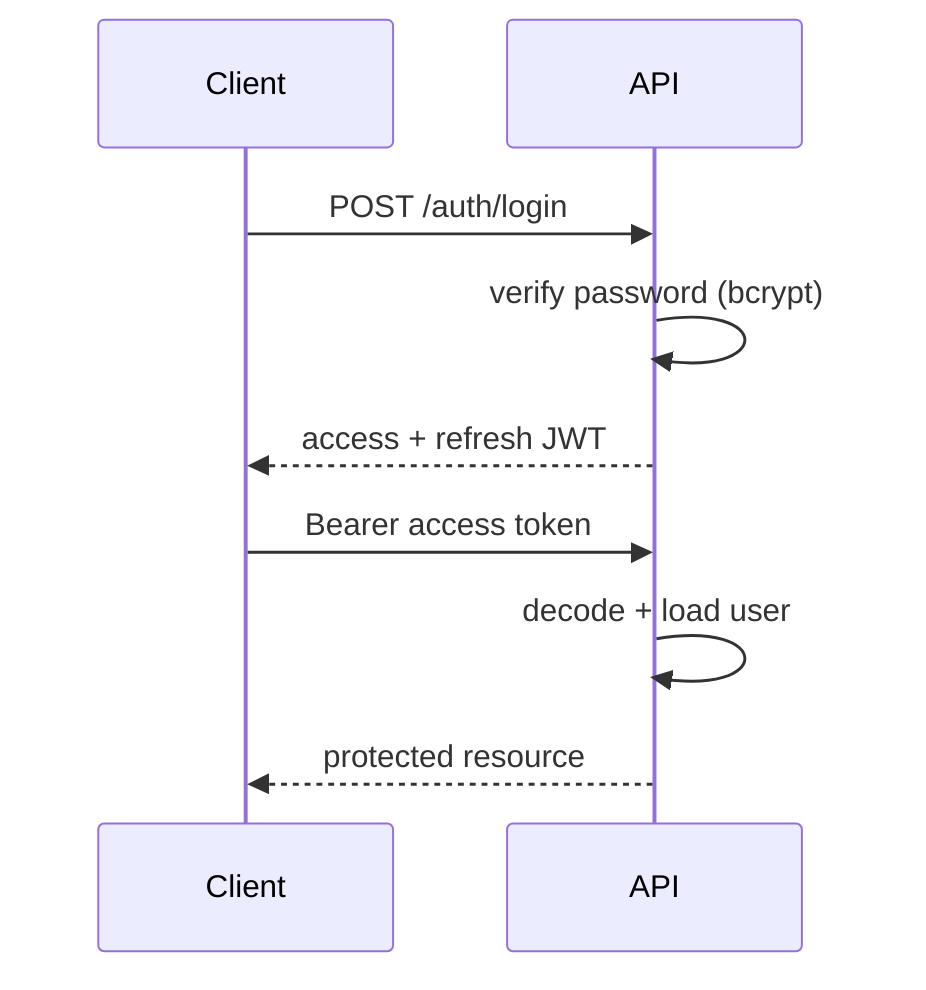

# Step 8: Full REST API

## Overview

Step 8 completes the **production REST API** with JWT authentication, repository CRUD, webhooks, rate limiting, and centralized exception handling.

## Architecture

## Endpoints Added / Completed

| Method | Endpoint | Description |
|--------|----------|-------------|
| POST | `/auth/register` | User registration + tokens |
| POST | `/auth/login` | JWT login |
| POST | `/auth/refresh` | Refresh access token |
| GET | `/repository` | List user repositories |
| DELETE | `/repository/{id}` | Delete repository |
| POST | `/webhooks/github` | GitHub PR events → predict |
| POST | `/webhooks/gitlab` | GitLab MR events → predict |

All prediction, repository, and analysis routes respect `get_current_user`.

## Configuration

| Setting | Default | Description |
|---------|---------|-------------|
| `AUTH_ENABLED` | `false` | Enable JWT on all protected routes |
| `GITHUB_WEBHOOK_SECRET` | — | HMAC secret for GitHub webhooks |
| `GITLAB_WEBHOOK_SECRET` | — | Token for GitLab webhooks |
| `RATE_LIMIT_REQUESTS` | 100 | Max requests per window |
| `RATE_LIMIT_WINDOW_SECONDS` | 60 | Rate limit window |

## Auth Flow

## Webhook Flow

1. Verify signature (GitHub HMAC / GitLab token)
2. Parse PR/MR payload → synthetic diff
3. Match repository by normalized URL
4. Queue prediction pipeline (202)

## Next Step

**Step 9 — React Frontend + Visualizations**
