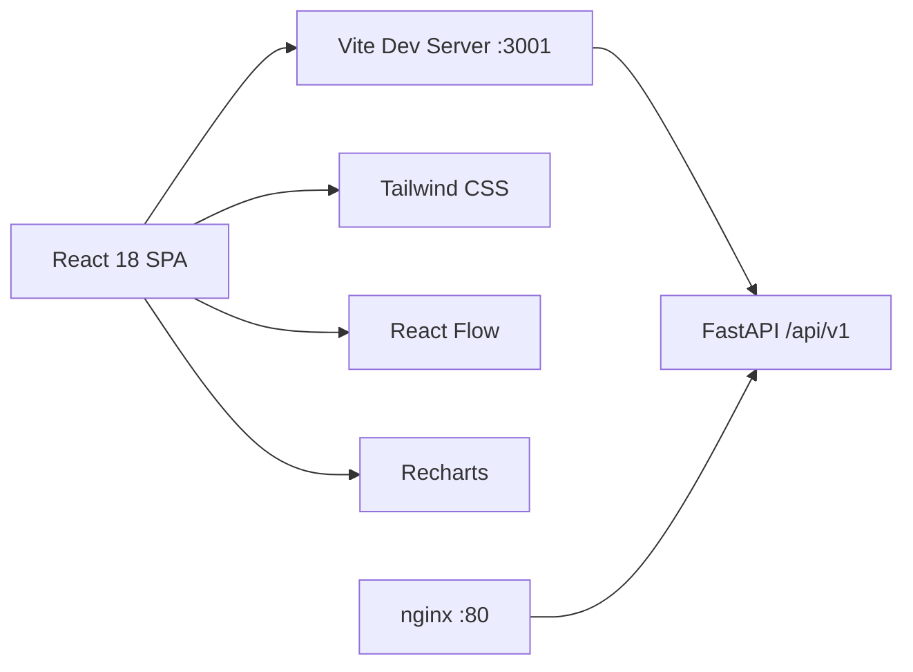
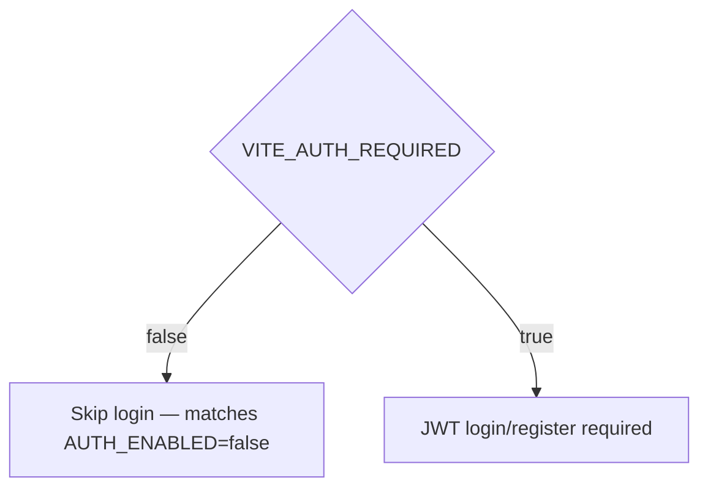

# Step 9: React Frontend + Visualizations

## Overview

Step 9 adds a **React + Vite + TypeScript** SPA for repository management, impact prediction, risk dashboards, and dependency graph visualization.

## Stack



| Layer | Technology |
|-------|------------|
| Build | Vite 6, TypeScript 5 |
| UI | React 18, React Router 6 |
| Styling | Tailwind CSS (slate/cyan dark theme) |
| Graph viz | `@xyflow/react` |
| Charts | Recharts (risk trend) |

## Pages

| Route | Component | Purpose |
|-------|-----------|---------|
| `/` | Dashboard | Repositories CRUD, sync, risk summary |
| `/predict` | Predict | Submit unified diff → queue prediction |
| `/prediction/:id` | PredictionDetail | Poll result, risk gauge, explanation, subgraph |
| `/graph` | Graph | Full graph or BFS subgraph by seed files |
| `/login`, `/register` | Auth | Shown when `VITE_AUTH_REQUIRED=true` |

## API Client

- Base URL: `VITE_API_BASE` (default `/api/v1`)
- Dev proxy: Vite forwards `/api` → `http://localhost:8000`
- JWT stored in `localStorage` when auth is enabled

## Auth Modes



Set `VITE_AUTH_REQUIRED=true` when backend `AUTH_ENABLED=true`.

## Docker

```bash
docker compose up frontend api
# UI: http://localhost:3001
# API: http://localhost:8000/api/v1/docs
```

The frontend container serves static assets via nginx and proxies `/api/` to the `api` service.

## Local Development

```bash
cd frontend
cp .env.example .env
npm install
npm run dev
```

## Components

- **RiskGauge** — SVG circular risk score (0–100)
- **AffectedFilesList** — Ranked break probability per file
- **DependencyGraph** — React Flow node/edge layout from graph API
- **Layout** — Navigation shell with IBM Plex typography

## Next Step

**Step 10 — XAI (SHAP, Attention weights)**
