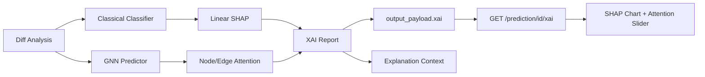

# Step 10: XAI (SHAP + Attention)

## Overview

Step 10 adds **explainability** to the prediction pipeline: SHAP-style feature attributions for the classical risk classifier and GNN node/edge attention scores. Results are stored on each prediction and exposed via a dedicated API endpoint and frontend visualizations.

## Architecture



## Components

| Module | Purpose |
|--------|---------|
| `ml/xai/shap_explainer.py` | Exact linear SHAP for `ClassicalRiskClassifier` weights |
| `ml/xai/attention_extractor.py` | Rank GNN `node_importance` / `edge_importance` |
| `ml/xai/xai_service.py` | Unified `XAIReport` builder |
| `GET /prediction/{id}/xai` | REST endpoint for explainability payload |

## SHAP Method

The classical classifier uses a weighted logit:

```
logit = BIAS + Σ (weight_i × feature_i)
```

For this linear model, SHAP values are **exact**: `φ_i = weight_i × feature_i`. An optional `XAI_USE_SHAP_LIBRARY=true` path validates attributions via the `shap` package.

## GNN Attention

Node attention ranks entries from `GNNPredictionResult.node_importance`, enriched with graph metadata (name, file path). Edge attention surfaces top weighted edges when available.

## Configuration

| Setting | Default | Description |
|---------|---------|-------------|
| `XAI_ENABLED` | `true` | Run XAI during prediction pipeline |
| `XAI_USE_SHAP_LIBRARY` | `false` | Validate with `shap` LinearExplainer |

## API

```http
GET /api/v1/prediction/{prediction_id}/xai
```

Returns `XAIReportResponse` with `feature_attributions`, `node_attentions`, and `edge_attentions`.

## Frontend

Prediction detail page includes:

- **SHAP bar chart** — top feature drivers (Recharts)
- **Node attention slider** — horizontal scroll of GNN attention scores

## Next Step

**Step 11 — Evaluation Framework**
