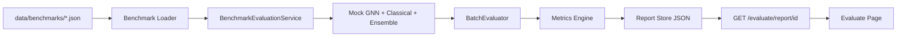

# Step 11: Evaluation Framework

## Overview

Step 11 adds a **benchmark-driven evaluation framework** to measure prediction quality against golden datasets with production metric targets.

## Architecture



## Metrics

| Metric | Target | Description |
|--------|--------|-------------|
| Precision@K | ≥ 0.70 | Top-K affected file accuracy |
| Recall@K | ≥ 0.65 | Ground-truth file coverage |
| F1 | ≥ 0.67 | Binary regression classification |
| ROC AUC | ≥ 0.85 | Ranking quality proxy |
| Risk RMSE | ≤ 15.0 | Risk score error |
| MRR | ≥ 0.60 | Mean reciprocal rank for files |
| Calibration ECE | ≤ 0.05 | Confidence reliability |

## Golden Benchmark

Default suite: `data/benchmarks/default.json`

Each sample contains a unified diff and ground truth labels (`risk_score`, `is_regression`, `affected_files`).

## API

| Method | Endpoint | Description |
|--------|----------|-------------|
| GET | `/evaluate/targets` | Production metric targets |
| POST | `/evaluate/benchmark` | Run benchmark, save report |
| GET | `/evaluate/reports` | List recent reports |
| GET | `/evaluate/report/{id}` | Fetch report by ID |

## CLI

```bash
python scripts/run_evaluation.py default
```

## Configuration

| Setting | Default | Description |
|---------|---------|-------------|
| `EVALUATION_STORAGE_PATH` | `/data/evaluations` | Report JSON storage |
| `EVALUATION_BENCHMARK_PATH` | `data/benchmarks` | Benchmark suite directory |

## Next Step

**Step 12 — CI/CD, Monitoring, Production Hardening**
