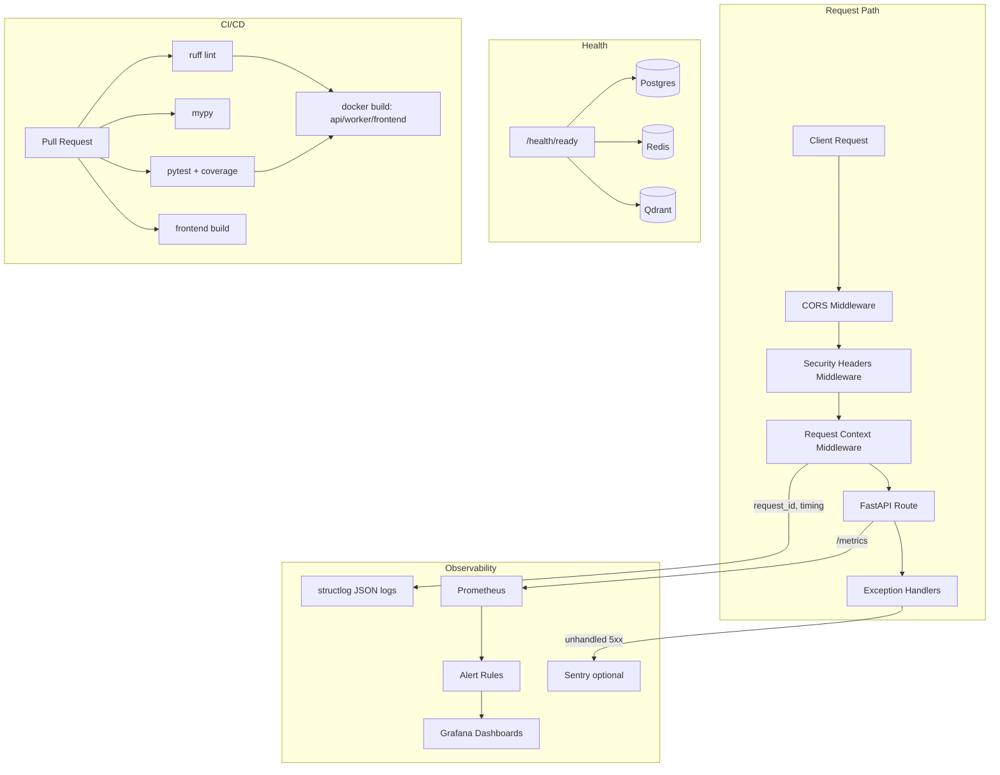

# Step 12: CI/CD, Monitoring, Production Hardening

## Overview

Step 12 closes the roadmap by making the platform operable in production: structured observability, dependency-aware health checks, a hardened container image, a wider CI pipeline, and alerting on top of the existing Prometheus/Grafana stack.

## Architecture



## Observability

- **`RequestContextMiddleware`** (`src/code_impact/infrastructure/observability/middleware.py`): generates or forwards an `X-Request-ID`, binds it to `structlog` contextvars for the lifetime of the request, and logs a structured `request_completed` / `request_failed` event with duration.
- **`SecurityHeadersMiddleware`**: adds `X-Content-Type-Options`, `X-Frame-Options`, `Referrer-Policy`, and `Permissions-Policy` to every response.
- **Sentry (optional)**: `init_sentry()` is a no-op unless `SENTRY_DSN` is set, and degrades gracefully if `sentry-sdk` isn't installed (`pip install ".[monitoring]"`).
- **Global exception handler**: any unhandled exception is logged with a full traceback and returned as a generic `500` instead of leaking internals; `RateLimitExceeded` now maps to `429` centrally instead of per-route.

## Readiness Checks

`GET /api/v1/health` remains a pure liveness probe. `GET /api/v1/health/ready` now actively pings PostgreSQL (`SELECT 1`), Redis (`PING`), and Qdrant (`/readyz`), returning `ready` or `degraded` with a per-dependency status — suitable for Kubernetes readiness probes or load balancer health checks.

## Container Hardening

- Multi-stage `docker/Dockerfile` now runs as a non-root `appuser`, adds `HEALTHCHECK` instructions for both the API and Celery worker targets, and pre-creates data directories with correct ownership.
- `.dockerignore` keeps build context small and avoids leaking `.env`, tests, and docs into images.
- `docker-compose.yml` adds `restart: unless-stopped`, worker/frontend/qdrant healthchecks, and dependency conditions so `worker` only starts once `api` is healthy.

## CI/CD Pipeline (`.github/workflows/ci.yml`)

| Job | Purpose |
|-----|---------|
| `lint` | `ruff check` |
| `typecheck` | `mypy` (non-blocking) |
| `test` | unit + integration tests with coverage report uploaded as an artifact |
| `frontend` | `npm ci`, typecheck, `vite build` |
| `docker` | builds the `api`, `worker`, and `frontend` images to catch Dockerfile regressions |

Pip and npm dependencies are cached via `actions/setup-python` and `actions/setup-node` to keep runs fast.

## Monitoring

- `docker/prometheus/alerts.yml` defines three alert rules evaluated by Prometheus itself: `APIHighErrorRate` (5xx ratio > 5%), `APIHighLatency` (p95 > 2s), and `APITargetDown` (scrape failing).
- `docker/grafana/dashboards/api-overview.json` is auto-provisioned (via `docker/grafana/provisioning/dashboards/dashboards.yml`) into a "Code Impact" Grafana folder with request rate, error rate, latency percentiles, and an uptime panel.

## Configuration

New settings in `.env.example`:

```
SENTRY_DSN=
SENTRY_TRACES_SAMPLE_RATE=0.1
```

Both are optional — omitting `SENTRY_DSN` keeps error tracking disabled with zero overhead.
